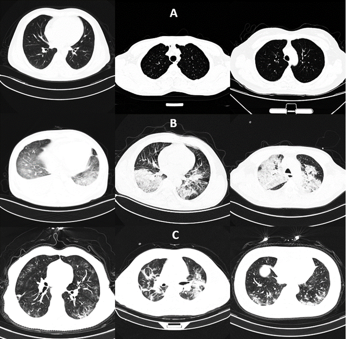
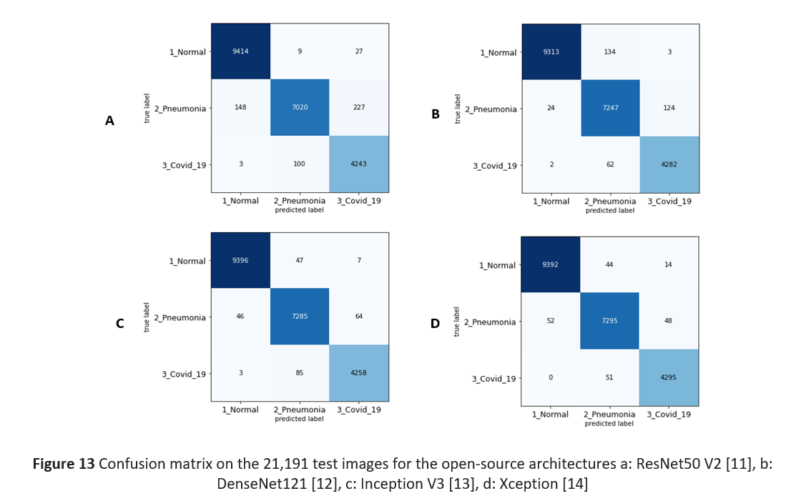
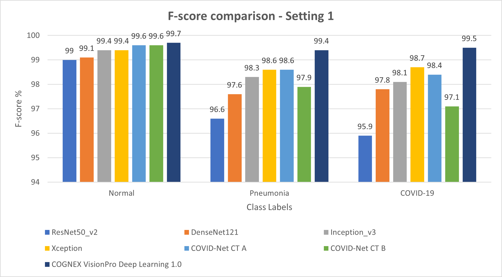

# Covid-19-CT-image-classification

### Images

A - Normal Images,
B - Non-COVID-19 (Pneumonia),
C - COVID-19

### Confusion-Matrix

### F-Score Comparison

###### Link to paper - https://arxiv.org/abs/2010.00958
